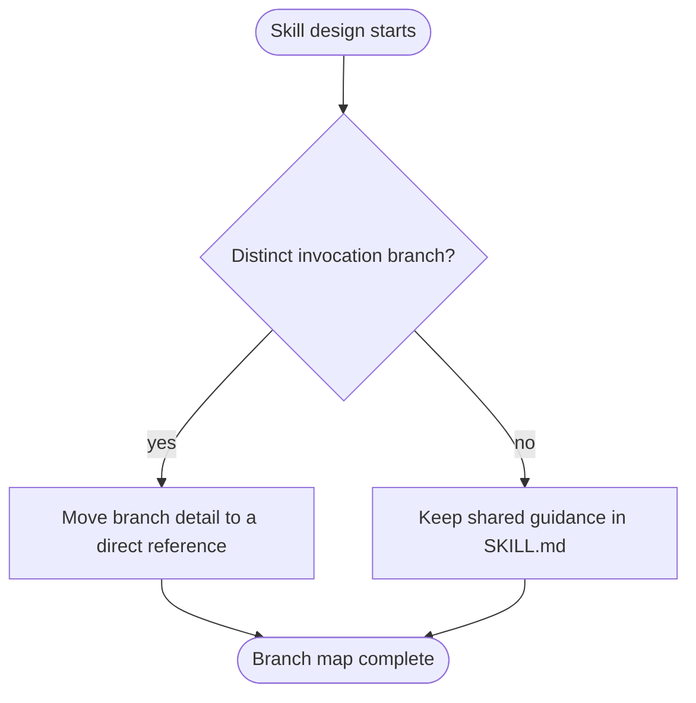

# Designing Skills

Use this reference when creating a skill or changing its behavior.

## Capture intent without re-interviewing

Derive answers from the conversation, existing files, examples, corrections, and tool history before asking questions. Group unresolved questions in one turn when possible. Confirm assumptions only when a different answer would change the artifact.

A sufficient intent record names:

- the reusable capability;
- who or what invokes it;
- positive triggers and near-misses;
- inputs, outputs, and consequential edge cases;
- required tools or environment;
- examples of success and failure;
- whether success is objective, process-observable, or subjective.

## Use Pi's skill contract

A Pi skill is a directory containing `SKILL.md` with YAML frontmatter.

- `name`: required, 1-64 lowercase letters, numbers, or hyphens; match the directory for cross-client compatibility.
- `description`: required, non-empty, at most 1024 characters.
- `compatibility`: optional, at most 500 characters; state only verified requirements.
- `license`: optional; include it when copied or adapted material requires one.
- `metadata` and `allowed-tools`: optional; add only for a concrete consumer.
- `disable-model-invocation: true`: Pi-only choice for a skill that should be reached manually. Omit it for model invocation.

Pi may load some invalid skills with warnings. Author to the strict contract so warnings are evidence of a defect, not an accepted state.

## Write a description, not a miniature skill

For a model-invoked skill, write one compact identity clause followed by distinct trigger branches. State **what it handles and when it applies**. Include language users actually use, but do not summarize enough procedure for the agent to act without reading the body. One branch earns one trigger clause; synonyms for the same branch do not.

For a user-invoked skill, keep a concise human-facing description and set `disable-model-invocation: true`.

Test description behavior using the invocation reference. Prose review alone cannot establish discoverability.

## Protect the information hierarchy

Rank content by when it is needed:

1. `SKILL.md` steps shared by every branch.
2. `SKILL.md` rules needed during those steps.
3. Branch-specific reference files reached through direct, descriptive pointers.
4. Scripts for deterministic repeated or fragile operations.
5. Assets used directly in produced output.

Keep references one level from `SKILL.md`; make every support file directly reachable. Co-locate a rule with its exceptions and completion criterion. A step is complete only when its criterion is checkable and, where needed, exhaustive.

Split by branch when different invocations need different detail. Split by sequence only after observing premature completion that a sharper completion criterion did not fix.

## Visualize non-obvious branches with Mermaid

Pi renders top-level `mermaid` code fences as Unicode diagrams in the interactive TUI. Use a diagram for branch selection, state transitions, or loops that are easier to verify spatially. Keep linear procedures as numbered lists and flat facts as tables.

Use `flowchart TD` by default. Name nodes semantically:

- decisions: `{Question?}`;
- actions: `[Verb phrase]`;
- states: `([State])`;
- edges: `-->|observable condition|`.

A diagram is a view of one decision seam, not a second source of truth. Keep detailed rules in one adjacent section and replace an equivalent prose flowchart rather than duplicating it. Rendering can be set to `off`, `final`, or `streaming`; the Mermaid source remains readable when rendering is disabled or the diagram is too wide.

## Match instruction form to the failure

| Observed failure | Use | Avoid |
| --- | --- | --- |
| Output has the wrong shape | Positive output contract with ordered parts | A list of forbidden shapes |
| Required element is omitted | Required slot in the produced structure | A reminder far from the structure |
| Behavior varies by condition | Conditional keyed to an observable predicate | A universal rule plus vague exceptions |
| Known rule is skipped under pressure | Clear guardrail, observed rationalization counter, and desired action | Soft preference language |
| Agent lacks technique or facts | Concise procedure, example, or reference | Compliance rhetoric |

Use prohibitions only for hard guardrails or demonstrated discipline failures, and pair each with the action to take. For shaping, name the target behavior directly.

## Prune to one source of truth

Give each meaning one owner. Then inspect every sentence:

- **Duplication:** same meaning in multiple places. Keep the deepest authoritative owner.
- **Sediment:** content that belonged to an older workflow. Delete it.
- **Sprawl:** live material on the wrong information tier. Disclose it by branch.
- **No-op:** wording that does not change behavior from the baseline. Remove it.
- **Premature completion:** a step ends before its criterion. Sharpen the criterion before adding prose.

A compact leading term can replace repeated explanations when it recruits the intended behavior consistently. Keep it only if tests show it earns its context cost.

## Add resources only when they execute a job

Bundle a script when multiple runs otherwise recreate the same fragile operation. Prefer the standard library, explicit errors, deterministic outputs, and a focused happy-path check. Verify the complete dependency closure and state whether the agent should execute or read the script.

Bundle a reference only for branch-specific material that changes execution. Bundle an asset only when the final output uses it. Keep evaluation runs, generated reports, caches, and package archives outside the skill unless the user requires them as deliverables.
